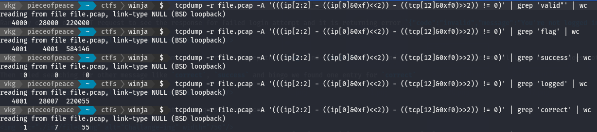

# WinjaCTF c0c0n 2020

### Jump the Shark!

``` https://drive.google.com/drive/folders/1ofCmxg7ifVOqyr1whiUTm714eMRCJ1xw?usp=sharing ```

Gives a text,
> DUN DUN DUN DUN DUN DUN DUN DUN DUNANAAAA


[Challenge file link](./file/file.pcap)


### Approach

Open pcap file in wireshaek, it looks like brute-force attack.


Randomly opened one POST request to see the response for failed login attempt and it is returning error `{"code":"invalid","message":"You're not logged in"}`.


Used tcpdump to read file and set HTTP stream filter, tried to grep the `flag` and `invalid` count and it seems like for successful login message does not have `valid` in response, as `flag` has one more count than `valid`.

Then tried searching for other message like `correct`, `success` and bingo we found one entry for `correct`



And then greped few lines before match to get the request parameter.


But we don't have our flag yet, the value within brackets are hex encoded and we need to decode it, CyberChef did it easily.


** Bash **

``` bash
tcpdump -r file.pcap -A '(((ip[2:2] - ((ip[0]&0xf)<<2)) - ((tcp[12]&0xf0)>>2)) != 0)' | grep 'valid"' | wc 
tcpdump -r file.pcap -A '(((ip[2:2] - ((ip[0]&0xf)<<2)) - ((tcp[12]&0xf0)>>2)) != 0)' | grep 'flag' | wc 
tcpdump -r file.pcap -A '(((ip[2:2] - ((ip[0]&0xf)<<2)) - ((tcp[12]&0xf0)>>2)) != 0)' | grep 'success' | wc 
tcpdump -r file.pcap -A '(((ip[2:2] - ((ip[0]&0xf)<<2)) - ((tcp[12]&0xf0)>>2)) != 0)' | grep 'logged' | wc 
tcpdump -r file.pcap -A '(((ip[2:2] - ((ip[0]&0xf)<<2)) - ((tcp[12]&0xf0)>>2)) != 0)' | grep 'correct' | wc 
tcpdump -r file.pcap -A '(((ip[2:2] - ((ip[0]&0xf)<<2)) - ((tcp[12]&0xf0)>>2)) != 0)' | grep 'correct' -B 25
```
Later I realised it can be done via Wireshark easily using display filter

** Wireshark **

` http and frame contains correct `


** Flag **

`flag{alWd2mxA7TCtD_TheyWorkedForKorla}`
