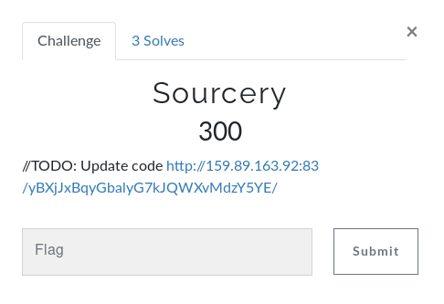
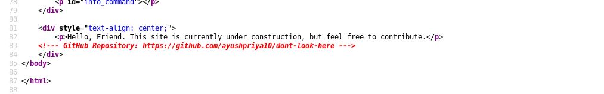
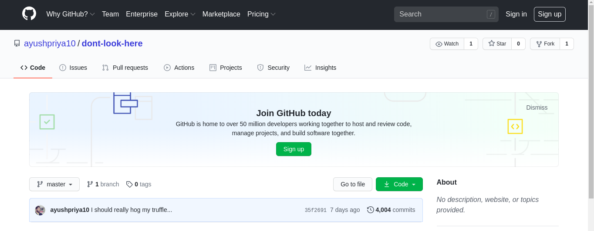
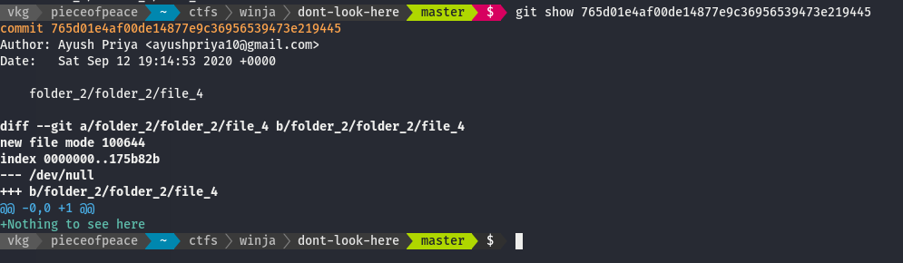
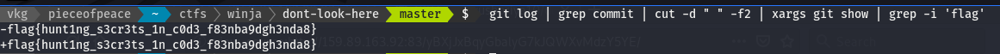

# WinjaCTF c0c0n 2020

### Sourcery

``` http://159.89.163.92:83/yBXjJxBqyGbalyG7kJQWXvMdzY5YE/ ```

Gives a text,
> /TODO: Update code




### Approach

Look for source code, and we found something



Git Repo has 4K+ commits



clone the repo to local machine and checked random commit, and it seems like files are randomly added and deleted.



** Bash onliner **

``` bash
git log | grep commit | cut -d ' ' -f2 | xargs git show | grep -i flag --color
```


